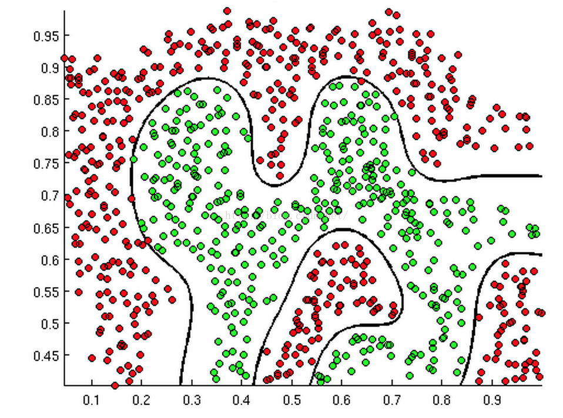

# 前言

逻辑回归是应用非常广泛的一个分类机器学习算法，它将数据拟合到一个 logit函数中，从而能够完成对事件发生的概率进行预测。

该文引用自:

作者：寒小阳 && 龙心尘
时间：2015年10月。
出处：<http://blog.csdn.net/han_xiaoyang/article/details/49123419>。

# 由来

线性回归能够对连续值进行预测，而现实生活中常见的另外一类问题是，分类问题。最简单的情况是二分类问题。比如说医生需要判断病人是否生病，银行需要判断一个人的信用程度是否达到可以给他发信用卡的程度，邮件收件箱要自动对邮件分类为正常邮件和垃圾邮件等等。当然，我们最直接的想法是，既然能够用线性回归预测出连续结果，那根据结果设定一个阈值是不是就可以解决这个问题？事实上，对于很标准的情况，确实可以。我们看下面这个情况：

但是，在很多情况下，我们需要学习的分类数据并没有这么精准，比如说上述例子中突然有一个异常数据点出现，如下图所示：

这个时候，在通过设定阈值为0.5就失效了，而现实生活中分类问题的数据，会比例子中这个更为复杂，所以我们借助线性回归+阈值的方式，已经很难完成一个鲁棒性很好的分类器了。在这个场景下，逻辑回归就诞生了，它的核心思想是，如果线性回归的结果输出是一个连续值，而值的范围是无法限定的，那我们有没有办法把这个结果值映射为可以帮助我们判断的结果呢？而如果输出结果是(0,1)的一个概率值，这个问题就很清楚了，在数学上，sigmod函数可以做这件事：

# 判定边界

我们现在再来看看，为什么逻辑回归能够解决分类问题，这里引入一个概念，叫做判定边界，可以理解是用以对不同类别的数据分割的边界，边界的两旁应该是不同类别的数据。

上述三幅图中的红绿样本点为不同类别的样本，而我们划出的线，不管是直线，圆或者是曲线，都能够比较好的将图中的两类样本分割开来。这就是我们的判定边界。

回到sigmoid函数，我们发现：

g(z) >= 0.5 时， z>=0，此时意味着y =1

g(z) <= 0.5时， z<=0，此时意味着y=0

所以我们认为 z = 0 是一个决策边界，当它大于0或小于0时，逻辑回归模型分别预测不同的分类结果。

理论上说，只要我们的z设计得足够合理，我们能在不同的情形下，拟合出不同的判定边界，从而把不同的样本点分隔开来。

# 代价函数与梯度下降

我们通过对判定边界的说明，知道会有合适的参数θ使得θTx=0成为很好的分类判定边界，那么问题来了，我们如何判定我们的参数θ是否合适，有多合适呢？更进一步，我们有没有办法取求得这样的合适的参数？这就是我们要提到的代价函数与梯度下降了，所谓的代价函数Cost Function，其实是一种衡量我们在这组参数下预估的结果和实际结果差距的函数。但是，代价函数不是随便选的，我们都希望代价函数是一个凸函数，这样的话，凸函数有很好的函数性质，可以得到全局最优解，所以，逻辑回归的代价函数如下所示：

# 说明

大家可以通过jupyter notebook来查看这次项目实战，数据放在input文件夹中。以上只是对逻辑回归进行一个简单的介绍，如果想更深入的了解逻辑回归，可以阅读以下资料:

- [从初等数学视角解读逻辑回归](http://blog.csdn.net/han_xiaoyang/article/details/49332321)